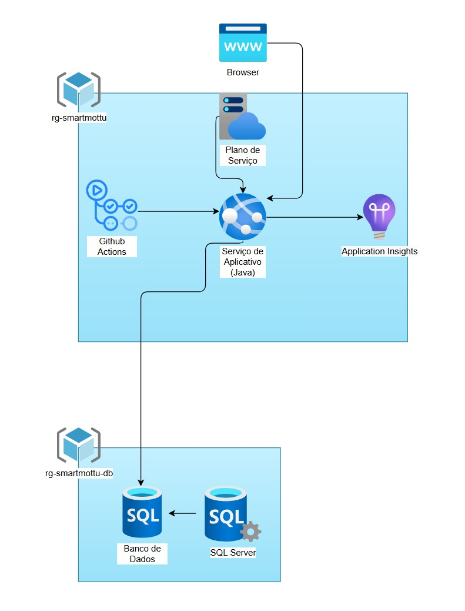

# SmartMottu – DevOps Tools & Cloud Computing

Aplicação web Java (Spring Boot 3, Java 17) com front Thymeleaf, hospedada no Azure App Service (Linux) e banco de dados no Azure SQL Database.

## Introdução
A Mottu é uma empresa de aluguel de motos a baixo custo (R$26,40/dia),
oferecendo não só o veículo, mas também crédito, manutenção, assistência,
oportunidades de trabalho (Delivery e iFood) e três modelos principais: Pop, Sport (a
mais econômica do Brasil) e Mottu-E (elétrica). Produz motos em Manaus em
parceria com a Índia e utiliza IoT e GPS para rastreamento.
O problema identificado é a desorganização dos pátios: dificuldade em
localizar motos paradas sem placa, com chassi encoberto ou quando o GPS entra
em “sleeping”. Isso causa retrabalho, atrasos e queda de produtividade,
prejudicando a experiência do cliente.

## Solução Proposta
A proposta consiste em desenvolver uma plataforma inteligente de gestão de
pátios para a Mottu, integrando visão computacional, IoT e QR Code. O sistema
contará com câmeras 360° que captam o ambiente em tempo real, permitindo que a
visão computacional identifique motos mesmo sem placa ou chassi visível. Cada
moto terá um cadastro completo (tipo, modelo, placa, chassi e foto) armazenado em
banco de dados e vinculado a um QR Code exclusivo, que funciona como
identificador digital para acesso rápido a informações e histórico. A plataforma
possibilitará que o operador selecione a moto desejada e, por meio das câmeras, o
sistema a localize visualmente em tempo real. Além disso, será gerado um histórico
individual de movimentações, manutenções e alterações de status.
Com isso, o problema da perda de motos no pátio é solucionado de forma
prática e escalável, garantindo rastreabilidade, eficiência operacional e otimização
do trabalho dos operadores.


## Arquitetura da solução



Fluxos principais:
- GitHub Actions → Web App: Deploy (CI/CD)
- Browser → Web App: HTTP/HTTPS
- Web App → Azure SQL Database: JDBC (TLS)
- Web App → Application Insights: Telemetria (agent codeless)

## Detalhamento dos Componentes (Requisito 3)

| Nome do componente | Tipo | Descrição funcional | Tecnologia/Ferramenta |
|---|---|---|---|
| Repositório de código | SCM | Versionamento do código-fonte e integração com CI | GitHub (repo: smartmottu-devops-3) |
| IDE | Ferramenta de desenvolvimento | Edição do código, commits e integração com Git | Visual Studio Code |
| Linguagem e Framework | Backend | API/Pages MVC, regras de negócio e endpoints do CRUD | Java 17 + Spring Boot (MVC, Data JPA, Security, Thymeleaf) |
| Gerenciador de Build | Build | Compila, resolve dependências e empacota | Maven (mvnw) |
| Testes automatizados | Testes | Testes unitários de serviços e regras | JUnit 5 (Mockito quando aplicável) |
| Banco de Dados | PaaS (DBaaS) | Persistência dos dados da aplicação | Azure SQL Database |
| Acesso a dados/ORM | Biblioteca | Mapeamento ORM e repositórios | Spring Data JPA + JDBC Driver SQL Server |
| Pipeline de CI | Orquestrador CI | Dispara a cada push na branch main/master; build, testes, publicação de artefato e build/push da imagem | Azure DevOps Pipelines (gatilho GitHub) |
| Artefato de Build | Repositório de artefatos | Publicação do .jar e metadados do build | Azure DevOps Pipeline Artifacts |
| Segredos/Variáveis | Gestão de segredos | Armazena variáveis protegidas (conn string, credenciais) | Azure DevOps Library (Variables/Variable Groups); opcional: Azure Key Vault |
| Pipeline de CD | Orquestrador CD | Deploy automático do contêiner gerado para o serviço de aplicação | Azure DevOps Pipelines (Release/Multistage) |
| Serviço de Aplicativo | PaaS (App) | Hospeda a aplicação em contêiner | Azure App Service — Web App for Containers (Linux) |
| Endpoint público | Acesso | URL pública para acesso ao app | FQDN do Web App (https://app-pt-rm556206.azurewebsites.net) |


## Provisionamento e Deploy (scripts)
O script `sprint4.sh` automatiza o provisionamento completo no Azure:
1) Criação dos Resource Groups (App e DB)
2) Criação do Azure SQL Server + Database
3) Execução do `script_bd.sql` via `sqlcmd` (DDL completa e seed inicial)
4) Criação do App Service Plan (Linux) e do Web App Java 17
5) Configuração das App Settings (string de conexão e variáveis do Spring)

Notas importantes:
- O arquivo `script_bd.sql` é executado pelo `sprint4.sh` (flag `sqlcmd -i`) para evitar expansão de `$` e manter o hash BCrypt da senha.
- O seed cria o usuário ADMIN com senha padrão `admin123`, armazenada como hash BCrypt (`$2a$10$veKob3hpyAUsj3R7x4QFgOc8R4I6DrHU9aTmANETcCq.Xgy4NCgmW`).
- Substitua as variáveis `SQL_ADMIN_USER`, `SQL_ADMIN_PASSWORD` e o hash no `script_bd.sql` antes de usar em produção.
- O script requer Azure CLI autenticada (`az login`) e `bash`. Para executar DDL/DML, requer `sqlcmd` (ou use Azure Cloud Shell Bash).

Caso prefira apenas provisionar o banco/manual, execute `script_bd.sql` diretamente com `sqlcmd -S <server>.database.windows.net -d <db> -U <user> -P <senha> -N -b -i script_bd.sql`.

## Passo a passo (Azure)
1) Pré-requisitos
- Azure CLI logada: `az login`
- Ambiente com `bash` e `sqlcmd` (Windows: Git Bash/WSL + sqlcmd; alternativa: Azure Cloud Shell Bash)

2) Executar o deploy
```bash
./sprint4.sh
```

3) Após o deploy
- Acessar: `https://SEU-APP.azurewebsites.net` (nesse caso é `https://app-pt-rm556206.azurewebsites.net`)

- Login DEV: `admin@email.com` / `admin123`
- Logout: GET `/logout`

4) Teste rápido de funcionalidade
- Acesse `/login` e autentique (Criando a conta ou logando com o admin).
- Vá para `/motos/new` e cadastre uma moto (chassi: exatamente 17 caracteres; placa: 7 caracteres). Se estiver inválido, o formulário mostrará mensagens de erro.
- Liste em `/motos` e verifique a nova moto.

## Troubleshooting (Azure)
- `sqlcmd` falhou (DDL/DML): verifique firewall do Azure SQL e credenciais
- Loop no login: garanta que a senha no banco corresponde ao encoder (repo está com NoOp + `admin123` para DEV)
- Erro 500 em `/motos`: redeploy para garantir templates atualizados; dados de status/modelo precisam existir (template é null-safe)
- Falha de start no Web App: conferir App Settings e ver Log Stream

## Acesso ao Banco de Dados (Azure SQL)
Você pode visualizar e consultar o banco provisionado no Azure SQL de duas formas:

- Azure Portal (Query editor)
	 - Abra o recurso do SQL Database no Portal Azure
	 - Clique em "Query editor (preview) ou Editor de consultas"
	 - Autenticação: SQL Login
		 - Usuário: valor da variável `SQL_ADMIN_USER` definida no `sprint4.sh`
		 - Senha: valor da variável `SQL_ADMIN_PASSWORD`
	 - Exemplos de consulta:
		 - `SELECT TOP 10 * FROM T_SMARTMOTTU_USUARIO;`
		 - `SELECT TOP 10 * FROM T_SMARTMOTTU_MOTO;`

Variáveis úteis no `sprint4.sh`:
- `SERVER_NAME`: nome do servidor lógico do Azure SQL (ex.: `sql-server-smartmottu`)
- `DB_NAME`: nome do banco (ex.: `db-smartmottu`)
- `SQL_ADMIN_USER`: usuário admin SQL (ex.: `user-smartmottu`)
- `SQL_ADMIN_PASSWORD`: senha do admin SQL (substitua em produção)

## Testes via HTTP (opcional)
Como a aplicação usa login por formulário, recomenda-se testar via navegador. Ainda assim, segue um roteiro opcional:
- Obter sessão autenticada via formulário em `/login`
- Enviar POST de criação de moto para `/motos` com os campos `nmChassi`, `placa`, `unidade`, `statusId`, `modeloId` usando cookies de sessão (complexo com curl; para demonstração use o navegador)

## Vídeo & Repositório
- Vídeo demonstrativo (passo a passo): https://youtu.be/FLnzPDp5jYs
- Repositório: https://github.com/Victor-Estrella/smartmottu-devops-3
